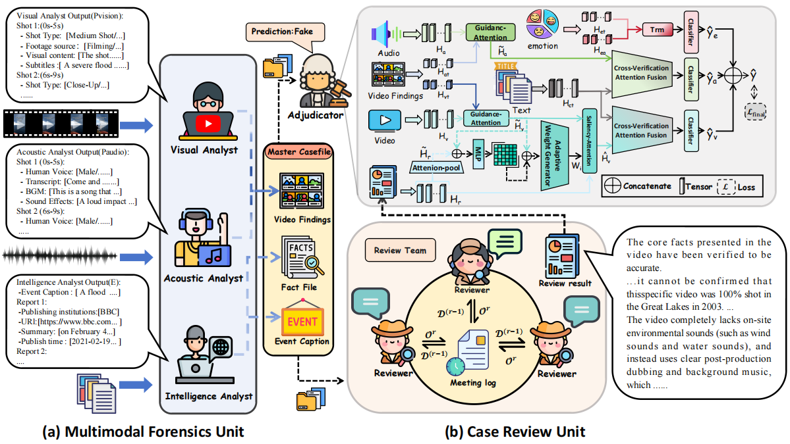

# 🎬CSI: An Investigative Multi-Agent Framework for Explainable Short Video Fake News Detection


Source code and dataset of the paper "CSI: An Investigative Multi-Agent Framework for Explainable Short Video Fake News Detection", which is accepted by Findings of the 64rd Annual Meeting of the Association for Computational Linguistics (ACL 2026).

---




## Architecture Overview
### 🎯  Multimodal Forensics Unit
(Each agent simultaneously)
- **Visual Analyst**: Analyze each shot in the video, generating a structured visual analysis $P_{\text{vision}}$ from the shot type, source material, visual content, and subtitles.
- **Acoustic Analyst**: For the audio in each video, generate structured audio analysis results $P_{\text{audio}}$ based on the boundaries of the shots, covering four aspects: human voice type, background music, sound effects, and transcription.
- **Intelligence Analyst**: Summarize the structured titles  $T_s$ that represent the core events in the titles and texts of short video news, and use the Google Search API to search for relevant official reports $E$ on the internet.

Output the **case file** (shoting script, structured titles and official reports)

### 🔄 Case Review Unit 
- **Review Team**:
Based on the case file, a review team consisting of three reasoning agents with different roles conducts discussions in three stages and outputs the final deliberation result $R$.
- **Adjudicator**:By comprehensively utilizing the case files and the review results, we can make the final decision on whether the original short video news content is true or false(Individual training).


## 🚀 Installation

1. Install required dependencies:
```bash
pip install -r requirements.txt
```

2. Set up environment variables:
```bash
export GOOGLE_API_KEY="your_google_api_key"
export OPENAI_API_KEY="your_openai_api_key"
```
3. Quick train Adjudicator:
 ```
 # Train the Adjudicator using FakeSV
  python main.py  --dataset fakesv  --mode train

  # Train the Adjudicator using FakeTT
  python main.py  --dataset fakett  --mode train 
  ```


## 📊Dataset
We conduct experiments on two datasets: [FakeSV](https://github.com/ICTMCG/FakeSV) and [FakeTT](https://github.com/ICTMCG/FakingRecipe/blob/main). 


